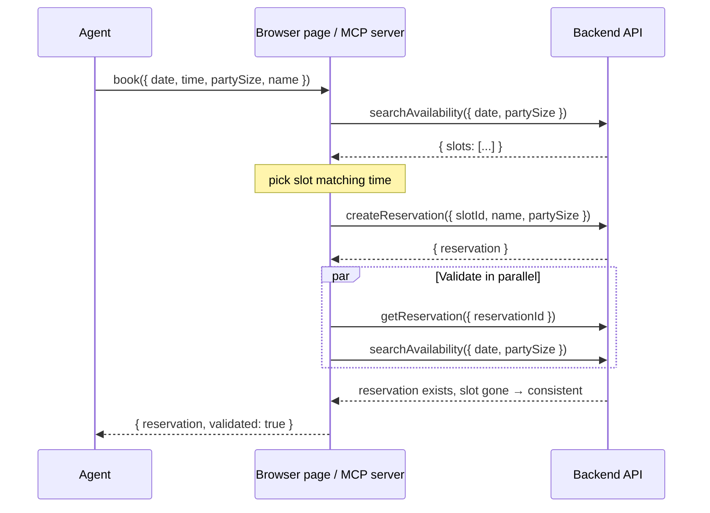
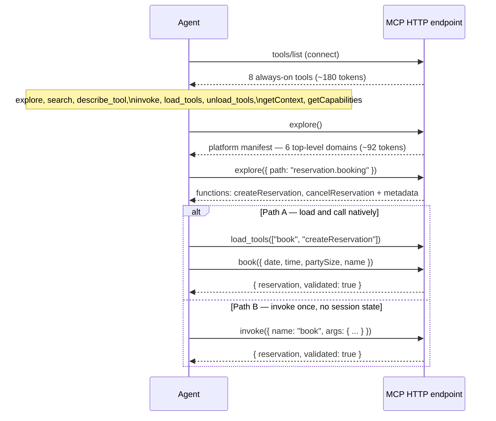
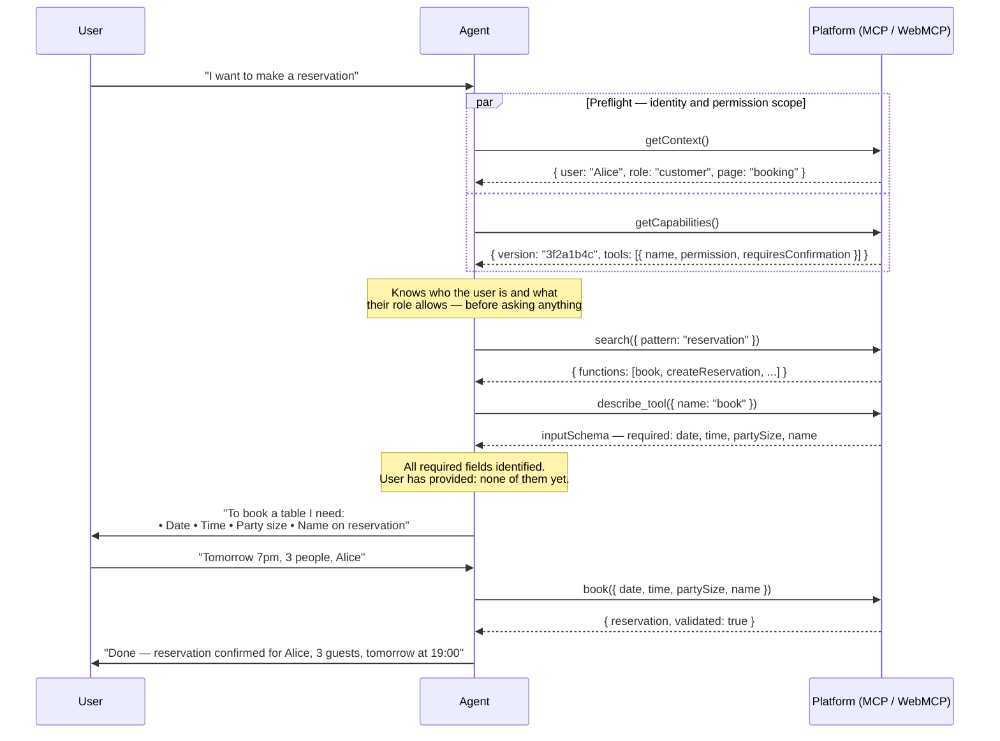

# WebMCP / AgentBridge

**Business logic that lives in the browser page, exposed to agents as structured tools through the WebMCP standard.**

WebMCP (`document.modelContext`) is a browser-native API that lets a page register callable tools for AI agents — the same way it registers event listeners for users. **AgentBridge** is the reference implementation: it adds RBAC, progressive tool disclosure, audit logging, a polyfill for today's browsers, and an MCP Streamable HTTP surface so external agents (Claude Code, Claude Desktop, MCP Inspector) can connect with no browser required.

Built on [Next.js](https://nextjs.org) and the [Model Context Protocol](https://modelcontextprotocol.io).

---

## Why it's faster

*10 bookings, localhost, in-memory store. Token model: 1 token ≈ 4 characters.*

| Metric | 3-call MCP | `book()` WebMCP | `book-op` MCP | Saving vs 3-call |
|---|---|---|---|---|
| Agent HTTP calls | 30 | 10 | 10 | **−66.7%** |
| Input tokens | 581 | 250 | 250 | −57.0% |
| Output tokens | 1,842 | 561 | 561 | −69.5% |
| Cumulative context tokens | 3,251 | 0 | 0 | **−100%** |
| **Total tokens** | **5,674** | **811** | **811** | **−85.7%** |
| Wall-clock avg / booking | 91 ms | 98 ms | **30 ms** | **−67%** |

`book-op MCP` (server-side in-process dispatch) is **3× faster** than the 3-call baseline: all three sub-operations run inside one request with no additional HTTP hops. `book() WebMCP` saves the same 85.7% of tokens but still makes 3 HTTP sub-calls internally from the browser.

*Cumulative context tokens = prior tool results the model re-reads on each subsequent call. A single composite call contributes zero.*

---

## The core idea

Every existing approach makes the **agent** orchestrate multiple calls:

```
Agent → searchAvailability()   →  parse slot list, extract slotId
Agent → createReservation()    →  parse result, decide to validate
Agent → getReservation()       →  finally confirm success
```

Three round-trips. Three reasoning gaps. Growing context. The agent must understand your domain well enough to sequence the calls correctly — that knowledge lives in the prompt, re-processed on every call, and can hallucinate.

**AgentBridge flips this.** Business logic lives in the frontend as a composite function registered into `document.modelContext`. The agent calls one tool and gets a validated result:

```
Agent → book({ date, time, partySize, name })  →  { reservation, validated: true }
```

One call. Zero reasoning gaps. The orchestration runs invisibly — in the browser (session-cookie auth) or in-process on the server (bearer token auth).

---

## Protocol flow

### 1. Composite tool — `book()` as a single agent call



The agent sees none of steps 1–3. If the post-condition check fails (reservation missing or slot still open), the orchestration rolls back via `cancelReservation` and returns a typed error. Source: `lib/core/book.ts`.

### 2. One registry, two surfaces

```mermaid
flowchart TD
    REG["lib/operations/\nOperation registry\n(45 business ops + 8 meta)"]

    REG -->|lib/adapters/mcp.ts| MCP["MCP Streamable HTTP\napp/api/[transport]/\nBearer token · 8h TTL"]
    REG -->|lib/adapters/webmcp.ts| WEB["In-page WebMCP\ndocument.modelContext\nSession cookie"]

    MCP --> EXT["External agents\nClaude Code · Claude Desktop\nMCP Inspector"]
    WEB --> BRW["Browser agents\nin-page JS · console"]

    subgraph book_surfaces["book() — same orchestration, different caller injection"]
        OP["lib/core/book.ts\nbookOrchestration(input, call)"]
        OP -->|makeDispatch(ctx)\nin-process handlers| MCP
        OP -->|serverCall → fetch('/api/call')\nbrowser HTTP| WEB
    end
```

Both surfaces expose `book()`. The only difference is the `call` function injected into `lib/core/book.ts`:

| Surface | `call` implementation | Auth |
|---|---|---|
| In-page WebMCP | `serverCall` → `fetch("/api/call")` | Session cookie |
| MCP Streamable HTTP | `makeDispatch(ctx)` → handler in-process | Bearer token |

### 3. Progressive tool disclosure — how agents discover operations



On connection only the 8 always-on navigation tools appear — about **180 tokens**. If all 53 operations were loaded at connect it would cost ~700 tokens on a 7-op platform and ~5,000 tokens on a 50-op enterprise platform — **paid on every single request**. With progressive disclosure that cost stays flat regardless of registry size.

### 4. Gather first, ask once — the full conversation pattern

The protocol is designed so the agent does all its research before saying a word to the user. The user gets one question, provides all the information in one reply, and the operation executes.



`getContext` tells the agent who the user is and what page they're on. `getCapabilities` gives the role-scoped tool catalogue — name, permission level, and whether confirmation is required — without full input schemas. Together they answer: *who is this person and what are they allowed to do?* The agent has this before the first `explore` call, so it can skip irrelevant domains, identify every required parameter by inspecting schemas, and surface a single consolidated question rather than a sequential Q&A.

This behaviour is enforced by the agent instructions delivered at connect time (MCP `initialize.instructions` / `document.modelContext.instructions`). See `lib/agent-instructions.ts`.

---

## The steps, explained

### Connect + preflight

When an agent connects to the MCP HTTP endpoint, `tools/list` returns **only the 8 always-on tools**:

| Tool | Role | What it returns |
|---|---|---|
| `getContext` | **Preflight** | Who the user is: `{ user, role, page, locale }` |
| `getCapabilities` | **Preflight** | What their role allows: `{ version, tools: [{ name, permission, requiresConfirmation }] }` |
| `explore` | Discovery | Module tree navigation by dot-path |
| `search` | Discovery | Find operations by Linux-style glob |
| `describe_tool` | Discovery | Full JSON Schema for named operation(s) |
| `invoke` | Execution | Call any operation, single or batch, without loading |
| `load_tools` | Session | Promote operations to native MCP tools for this session |
| `unload_tools` | Session | Remove promoted tools from `tools/list` |

**The agent should call `getContext` and `getCapabilities` in parallel immediately after connecting.** This is the preflight:

- `getContext` answers *who is this user?* — identity, current page, locale. The agent can personalise its behaviour and skip domains the user won't need.
- `getCapabilities` answers *what is this role allowed to do?* — the full tool list scoped to the caller's role, including which operations require explicit confirmation. The agent can rule out unauthorised tools without fetching their schemas first.

With this information in hand before any `explore` call, the agent can identify every relevant operation, fetch only the schemas it needs, aggregate all required parameters in one pass, and ask the user a **single consolidated question** rather than sequential one-at-a-time prompts.

### Discover

**`explore()` — tree navigation by path you already know:**

```json
// Step 1: understand the platform (no args)
// → { app: "AgentBridge Hospitality", modules: [reservation, crm, frontoffice, tasks, housekeeping, finance] }
// Cost: ~92 tokens

// Step 2: inspect a domain
explore({ "path": "reservation" })
// → { submodules: [reservation.availability, reservation.booking, reservation.search, reservation.admin] }

// Step 3: inspect a leaf module
explore({ "path": "reservation.booking" })
// → { functions: [{ name: "createReservation", permission: "write" }, { name: "cancelReservation", requiresConfirmation: true }] }

// Wildcard: entire subtree in one call
explore({ "path": "reservation.*" })

// Multi-path: two modules in one round-trip
explore({ "path": ["reservation.booking", "crm.guests"] })
```

**`search()` — discovery when you don't know the path:**

Patterns are Linux-style globs matched against `module/path/functionName` strings. A bare keyword with no metacharacters is auto-expanded to `**/*keyword*`.

```json
search({ "pattern": "**/*reservation*" })
// → { functions: [createReservation, cancelReservation, ...], modules: [...] }

search({ "pattern": "reservation" })
// identical — bare keyword auto-expanded

search({ "pattern": "*refund*" })
// → { functions: [{ name: "issueRefund", module: "finance.adjustments" }] }
```

Search is **role-scoped**: a `customer` token running `search({ pattern: "finance/**" })` returns nothing — finance is admin-only and results are filtered by role.

**`describe_tool()` — get the full input schema before calling:**

```json
describe_tool({ "name": ["searchAvailability", "createReservation"] })
// → [{ name, description, permission, inputSchema: { ... JSON Schema ... } }, ...]
```

### Execute

**Path A — load tools for the session** (best when calling the same ops 3+ times):

```
explore()                                 → platform manifest (92 tokens)
explore({ path: "reservation.booking" })  → see booking functions
load_tools(["book", "searchAvailability"])→ promote to native tools
book({ date, time, partySize, name })     → call as a native MCP tool
```

Loaded tools persist per-token for the 8-hour session lifetime. Different agents get independent load states.

**Path B — invoke once without loading** (best for one-off calls):

```json
// Single:
invoke({ "name": "searchAvailability", "args": { "date": "2026-07-23", "partySize": 2 } })

// Batch — reads run in parallel, writes run sequentially:
invoke({
  "calls": [
    { "name": "searchAvailability", "args": { "date": "2026-07-23", "partySize": 2 } },
    { "name": "listReservations",   "args": {} }
  ]
})
// → { "results": [ <availability>, <reservations> ] }  — one round-trip, two results
```

| Situation | Use |
|---|---|
| Calling the same ops 3+ times in a session | Path A — load once, call cheaply |
| One-off call | Path B — invoke directly |
| Don't know what the platform offers yet | `explore()` first |
| Know the function name but not the schema | `describe_tool()` then Path B |
| Two read results needed simultaneously | Path B batch — parallel dispatch |

---

## Features

### Progressive tool disclosure

Only 8 navigation/meta tools appear at connect time (~180 tokens). Business operations are discovered on demand via `explore` or `search` and either invoked directly or promoted to native tools via `load_tools`. A 50-operation enterprise platform costs ~5,000 tokens/request if all tools are loaded upfront; progressive invoke stays at ~200 tokens regardless of registry size.

### Composite operations

A composite tool (like `book`) wraps multi-step orchestration behind a single agent-facing call — availability check, reservation creation, and post-condition validation all happen invisibly. The orchestration logic lives in `lib/core/` (surface-agnostic), injected with either an HTTP caller (browser) or an in-process dispatcher (server). Context accumulation is zero: the agent has nothing to re-read.

### Two surfaces, one registry

The same 45 business operations are exposed over both surfaces simultaneously. Adding an operation to `lib/operations/` and registering it in `lib/operations/index.ts` makes it automatically available on both the MCP HTTP endpoint and `document.modelContext` — with full RBAC, audit logging, and progressive disclosure on both.

### RBAC and confirmation gates

Every operation carries a `roles` array checked on every call. Three roles exist: `customer` (own-data read/write), `support` (customer ops + cross-user read), and `admin` (all ops). Destructive operations carry `requiresConfirmation: true` — the UI shows a confirmation dialog; agents must pass `confirm: true` in the call. Operations with this flag: `cancelReservation`, `cancelAnyReservation`, `checkOutGuest`, `deleteTask`, `issueRefund`, `applyNoShowFee`.

### Audit log

Every call — agent-initiated or UI-initiated — is recorded with tool name, success/failure, and caller type. The last 100 entries are streamed to the UI via SSE (`/api/events`).

### Gather-first, ask-once — context, capabilities, and instructions

Three protocol features work together to give the agent everything it needs before it says a word to the user:

**`getContext`** — called on connect, returns the authenticated user's identity (`user`, `role`, `page`, `locale`). The agent knows who it is talking to and what page they are on. It can personalise responses and skip domains irrelevant to that user's role without fetching any schemas.

**`getCapabilities`** — called on connect (in parallel with `getContext`), returns every operation the caller's role is allowed to invoke: name, permission level, and `requiresConfirmation` flag. No input schemas yet — this is cheap. The agent can rule out unauthorised tools immediately and build the full picture of what is possible before exploring anything.

**Agent instructions** — delivered at connect time via `initialize.instructions` (MCP) and `document.modelContext.instructions` (WebMCP), both sourced from `lib/agent-instructions.ts`. The instructions contract:
1. Call `explore()` (and `describe_tool()`) to discover every required parameter before asking the user anything.
2. Identify **all** missing information in one pass.
3. Ask for all missing values in a **single message** — never a sequential Q&A.
4. Only after every required value is confirmed, execute write operations.

The combined effect: a user types *"I want to make a reservation"* and the agent responds with exactly one question listing every field it needs. The user fills them in. The operation executes. No back-and-forth.

### Capability versioning

`getCapabilities()` also returns a DJB2 version hash over the full operation fingerprint set (names, permissions, roles, schema keys). Agents can compare the hash between sessions and refresh their loaded tool list automatically if the registry has changed — no need to reload everything on every connect.

### WebMCP standard + polyfill

This project implements the WebMCP draft standard incubated by the W3C Web Machine Learning Community Group. The polyfill (`lib/webmcp-polyfill.ts`) installs a full `ModelContextImpl` on `document.modelContext` for browsers that don't yet support it natively, and is a no-op once the standard ships. AgentBridge adds on top: `permission` scopes, RBAC, `requiresConfirmation` gates, audit logging, progressive disclosure, capability versioning, and `executeBatch`.

---

## Reference

### Quick start

```bash
npm install
npm run dev
# Open http://localhost:3000
```

State is in-memory — resets on server restart.

### Connect an agent

**Claude Code:**

```bash
claude mcp add --transport http booking http://localhost:3000/api/mcp
```

Or add to `.mcp.json` (already included in this repo):

```json
{
  "mcpServers": {
    "agentbridge": {
      "type": "http",
      "url": "http://localhost:3000/api/mcp"
    }
  }
}
```

Then ask: *"Book me a table for 2 tomorrow evening"*

**Claude Desktop:** Settings → Connectors → Add custom connector → `http://localhost:3000/api/mcp`

**MCP Inspector:**

```bash
npx @modelcontextprotocol/inspector http://localhost:3000/api/mcp
```

Pass `Authorization: Bearer <token>` (your agent token is shown in the UI after login).

### Demo users

| Username | Password | Role |
|---|---|---|
| alice | password | customer |
| carol | password | support |
| bob | password | admin |

### In-page WebMCP (browser console)

After signing in, open the browser console:

```javascript
// List all available tools
document.modelContext.getTools().map(t => t.name)

// Call the composite book() tool
await document.modelContext.executeTool("book", {
  date: "2026-07-23",
  time: "18:00",
  partySize: 2,
  name: "Alice"
})
// → { success: true, data: { reservation: {...}, validated: true } }

// Glob search across the whole tree
await document.modelContext.executeTool("search", { pattern: "**/*reservation*" })

// Higher-level AgentBridge SDK
agentBridge.describe()
await agentBridge.call("searchAvailability", { date: "2026-07-23", partySize: 2 })
```

### Operations catalogue

**Always-on (8) — always in `tools/list`:**

| Name | Description |
|---|---|
| `explore` | Navigate the platform module tree by dot-path |
| `search` | Find functions/modules by Linux-style glob |
| `describe_tool` | Get full input schema for one or more named operations |
| `invoke` | Call any operation directly, single or batch |
| `load_tools` | Promote operations to native MCP tools for this session |
| `unload_tools` | Remove promoted tools from `tools/list` |
| `getContext` | Current page URL, auth state, locale |
| `getCapabilities` | Role-scoped manifest with version hash |

**Business operations (45) — discovered via `explore`/`search`, loaded via `load_tools` or called via `invoke`:**

#### Reservation — `reservation.*`

| Name | Permission | Roles | Notes |
|---|---|---|---|
| `searchAvailability` | read | all | |
| `listReservations` | read | all | own reservations |
| `getReservation` | read | all | |
| `createReservation` | write | all | |
| `cancelReservation` | write ⚠️ | all | `requiresConfirmation` |
| `listAllReservations` | read | support, admin | cross-user |
| `cancelAnyReservation` | write ⚠️ | admin | `requiresConfirmation` |
| `book` | write | all | composite: availability + create + validate |

#### CRM — `crm.*`

| Name | Permission | Roles |
|---|---|---|
| `searchGuests` | read | support, admin |
| `getGuest` | read | support, admin |
| `createGuest` | write | support, admin |
| `updateGuest` | write | support, admin |
| `getGuestPreferences` | read | all |
| `updateGuestPreferences` | write | all |
| `getLoyaltyStatus` | read | all |
| `addLoyaltyPoints` | write | support, admin |
| `listCommunications` | read | support, admin |
| `logCommunication` | write | support, admin |

#### Front Office — `frontoffice.*`

| Name | Permission | Roles | Notes |
|---|---|---|---|
| `checkInGuest` | write | support, admin | |
| `getCheckinStatus` | read | support, admin | |
| `checkOutGuest` | write ⚠️ | support, admin | `requiresConfirmation` |
| `getBillSummary` | read | all | |
| `getOccupancy` | read | support, admin | |
| `getWaitTime` | read | all | |
| `listShiftNotes` | read | support, admin | |
| `addShiftNote` | write | support, admin | |

#### Tasks — `tasks.*`

| Name | Permission | Roles |
|---|---|---|
| `createTask` | write | support, admin |
| `updateTask` | write | support, admin |
| `searchTasks` | read | support, admin |
| `deleteTask` | write ⚠️ | admin |
| `getMyTasks` | read | all |
| `completeTask` | write | all |

#### Housekeeping — `housekeeping.*`

| Name | Permission | Roles |
|---|---|---|
| `getTableCleaningStatus` | read | support, admin |
| `updateTableStatus` | write | support, admin |
| `getTodaySchedule` | read | support, admin |
| `markScheduleItemDone` | write | support, admin |
| `listInspections` | read | admin |
| `logInspection` | write | admin |

#### Finance — `finance.*`

| Name | Permission | Roles | Notes |
|---|---|---|---|
| `getDailyRevenueSummary` | read | admin | |
| `getWeeklyRevenueSummary` | read | admin | |
| `getPaymentRecord` | read | admin | |
| `listPayments` | read | admin | |
| `issueRefund` | write ⚠️ | admin | `requiresConfirmation` |
| `applyNoShowFee` | write ⚠️ | admin | `requiresConfirmation` |
| `logManualAdjustment` | write | admin | |

### Module tree

```
(platform root — AgentBridge Hospitality)
├── reservation              "Create and manage table reservations"
│     ├── reservation.availability   searchAvailability
│     ├── reservation.booking        createReservation, cancelReservation ⚠️
│     ├── reservation.search         listReservations, getReservation
│     └── reservation.admin          listAllReservations, cancelAnyReservation ⚠️
│         + composite: book
├── crm                      "Guest profiles, preferences, loyalty, communications"
│     ├── crm.guests                 searchGuests, getGuest, createGuest, updateGuest
│     ├── crm.preferences            getGuestPreferences, updateGuestPreferences
│     ├── crm.loyalty                getLoyaltyStatus, addLoyaltyPoints
│     └── crm.communications         listCommunications, logCommunication
├── frontoffice              "Day-of operations — check-in/out, occupancy, shifts"
│     ├── frontoffice.checkin        checkInGuest, getCheckinStatus
│     ├── frontoffice.checkout       checkOutGuest ⚠️, getBillSummary
│     ├── frontoffice.occupancy      getOccupancy, getWaitTime
│     └── frontoffice.shifts         listShiftNotes, addShiftNote
├── tasks                    "Operational task tracking across departments"
│     ├── tasks.management           createTask, updateTask, searchTasks, deleteTask ⚠️
│     └── tasks.assignments          getMyTasks, completeTask
├── housekeeping             "Venue cleanliness — status, schedules, inspections"
│     ├── housekeeping.status        getTableCleaningStatus, updateTableStatus
│     ├── housekeeping.schedule      getTodaySchedule, markScheduleItemDone
│     └── housekeeping.inspections   listInspections, logInspection
└── finance                  "Revenue, payments, refunds (admin only)"
      ├── finance.revenue            getDailyRevenueSummary, getWeeklyRevenueSummary
      ├── finance.payments           getPaymentRecord, listPayments
      └── finance.adjustments        issueRefund ⚠️, applyNoShowFee ⚠️, logManualAdjustment
```

⚠️ = `requiresConfirmation: true` — agent must pass `confirm: true`; UI shows a dialog.

Parent/child relationships are inferred from dot-path prefixes; the tree is defined in `lib/modules.ts` and builds automatically.

### Benchmark methodology and how to run

```bash
npm run dev              # start the server
node benchmark.mjs <session-cookie>
```

Your session cookie is shown in the browser DevTools after login, or in the UI.

What is measured: 10 bookings per approach against a local in-memory store. Token cost estimated at 1 token ≈ 4 characters, applied to the raw JSON payloads. Cumulative context tokens simulate re-reading prior tool results as a real agent would. See `benchmark.mjs` for full methodology.

Full benchmark output and annotated call timelines: open `docs/infographic-book-comparison.html` in a browser.

### Security model

| Control | Implementation |
|---|---|
| Browser authentication | Session cookie |
| MCP HTTP authentication | RFC 8707 audience-bound Bearer token, 8-hour TTL |
| Input validation | Zod schema on every call |
| RBAC | Per-operation `roles` array, checked at every call boundary |
| Destructive confirmations | `requiresConfirmation: true` — UI dialog + agent must pass `confirm: true` |
| Audit log | Every call recorded; last 100 entries streamed via SSE |
| Capability versioning | DJB2 hash over op fingerprints — agents detect registry changes |
| Token audience binding | RFC 8707 — a token minted for this server cannot be replayed elsewhere |

### Adding a server-side operation

1. **Create `lib/operations/your-op.ts`:**

```typescript
import { z } from "zod";
import { defineOperation } from "./types";
import { ok, fail } from "@/lib/result";

export const yourOp = defineOperation({
  name: "yourOp",
  title: "Your Op",
  description: "...",
  permission: "read",
  roles: ["customer", "admin"],
  module: "reservation.search",   // places it in the module tree
  tags: ["booking"],
  inputSchema: {
    id: z.string().describe("Resource ID"),
  },
  async handler({ id }, ctx) {
    const result = store.getItem(id, ctx.userId);
    if (!result) return fail("NOT_FOUND", `Item ${id} not found`);
    return ok({ result });
  },
});
```

2. **Register it in `lib/operations/index.ts`:**

```typescript
import { yourOp } from "./your-op";
registry.push(yourOp);
```

The operation automatically appears on both surfaces with full RBAC, audit logging, and progressive disclosure. To add a new module to the tree, append an entry to `MODULE_DEFS` in `lib/modules.ts`.

### Adding a composite tool

A composite tool has three layers: a surface-agnostic core, a browser wrapper, and an MCP operation.

**1. `lib/core/your-tool.ts`** — no `"use client"`, takes a `call` dependency:

```typescript
export async function yourToolOrchestration(
  input: YourInput,
  call: (name: string, params: Record<string, unknown>) => Promise<unknown>
): Promise<Result<YourResult>> {
  const a = await call("existingOp", { ...input }) as { success: boolean; data?: ... };
  if (!a.success) return fail(a.error?.code ?? "ERR", a.error?.message ?? "Failed");
  const b = await call("anotherOp", { id: a.data!.id }) as { success: boolean; data?: ... };
  if (!b.success) return fail(b.error?.code ?? "ERR", b.error?.message ?? "Failed");
  return ok({ result: b.data, validated: true });
}
```

**2. `lib/ui-tools/your-tool.ts`** — browser wrapper injecting `serverCall`:

```typescript
"use client";
import { serverCall } from "@/app/providers";
import { yourToolOrchestration } from "@/lib/core/your-tool";
export const yourTool = (input: YourInput) => yourToolOrchestration(input, serverCall);
```

**3. `app/providers.tsx`** — register into `document.modelContext` after auth:

```typescript
document.modelContext.registerTool({
  name: "yourTool",
  description: "Does X in one step.",
  inputSchema: { /* JSON Schema */ },
  execute: (input) => yourTool(input as YourInput),
});
```

**4. `lib/operations/your-tool-op.ts`** — MCP surface:

```typescript
export const yourToolOp = defineOperation({
  name: "yourTool",
  description: "Does X in one step.",
  permission: "write",
  roles: ["customer", "admin"],
  module: "your.module",
  inputSchema: { /* zod shape */ },
  async handler(input, ctx) {
    return yourToolOrchestration(input, makeDispatch(ctx));
  },
});
```

**5.** Register in `lib/operations/index.ts`. The tool is now callable on both surfaces.

### Project structure

```
app/
  page.tsx                 ← root page
  providers.tsx            ← auth context, book() registration, SSE events
  api/[transport]/route.ts ← MCP Streamable HTTP
  api/call/route.ts        ← UI operation dispatcher
  api/events/route.ts      ← SSE stream (store + audit events)

lib/
  core/book.ts             ← surface-agnostic booking orchestration
  operations/              ← operation registry (one file per op)
    book-op.ts             ← book as an MCP-registered operation
    dispatch.ts            ← in-process dispatcher: runOne(), makeDispatch(ctx)
  ui-tools/book.ts         ← thin browser wrapper for book()
  adapters/
    mcp.ts                 ← registry → MCP server tools
    webmcp.ts              ← registry → document.modelContext
  agentbridge.ts           ← AgentBridge SDK (register, call, describe, subscribe)
  webmcp-polyfill.ts       ← document.modelContext shim for pre-standard browsers
  modules.ts               ← module tree + explore()/search() helpers
  agent-instructions.ts    ← shared upfront instructions (both surfaces)
  capabilities.ts          ← version-hashed capability manifest
  store.ts                 ← in-memory state + event emitter
  auditlog.ts              ← audit log singleton
  auth.ts                  ← RBAC: users, sessions, tokens
  result.ts                ← ok() / fail() result envelope

benchmark.mjs              ← 3-call vs book() token + timing benchmark
docs/
  infographic-book-comparison.html  ← visual benchmark (open in browser)
```

### Tech stack

- **Next.js 15** (App Router, React 19)
- **TypeScript 5**
- **Zod** — runtime input validation, JSON Schema generation
- **`@modelcontextprotocol/sdk`** — MCP server + transport
- **`mcp-handler`** — Next.js MCP route handler
- **`zod-to-json-schema`** — Zod → JSON Schema for WebMCP tool registration

---

## License

MIT
